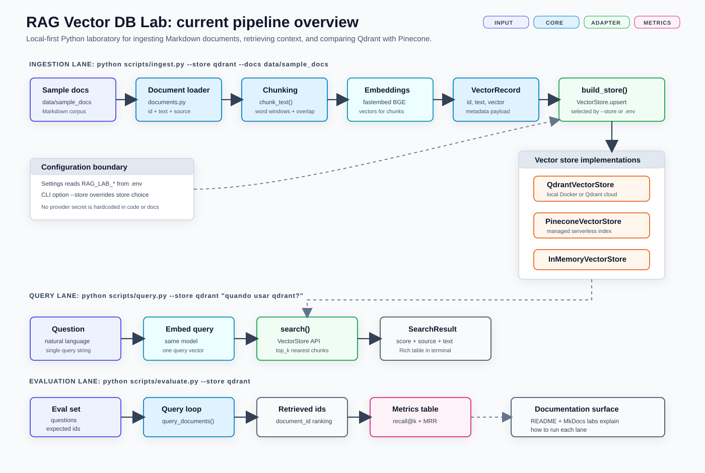

# RAG Vector DB Lab

Laboratorio pratico para aprender RAG comparando vector databases como Qdrant e Pinecone.

## Pipeline overview

<p align="center">
  
</p>

## Inicio rapido

```bash
python -m venv .venv
source .venv/bin/activate
python -m pip install --upgrade pip
python -m pip install -e ".[dev,docs]"
docker compose up -d qdrant
python scripts/ingest.py --store qdrant --docs data/sample_docs
python scripts/query.py --store qdrant "quando usar qdrant?"
mkdocs serve
```

## Labs

- Qdrant local: `docs/labs/01-local-qdrant.md`
- Pinecone cloud: `docs/labs/02-pinecone-cloud.md`
- Comparacao: `docs/labs/03-compare-results.md`

## O que o projeto cobre

- carregamento de documentos Markdown;
- chunking com overlap;
- embeddings locais com `fastembed`;
- adapters para Qdrant, Pinecone e store em memoria;
- scripts de ingestao, consulta e avaliacao;
- site MkDocs com conceitos e labs executaveis.

## Validacao

```bash
ruff check .
pytest -q
mkdocs build --strict
```

## Benchmark reproduzivel

```bash
docker compose up -d qdrant
python scripts/ingest.py --store qdrant --docs data/sample_docs
python scripts/benchmark.py --store qdrant --dataset evaluation/datasets/rag_lab_questions.jsonl
```

## Resultados

- Relatorio mais recente: `experiments/reports/latest.md`
- Resultado bruto: `experiments/results/latest.json`
